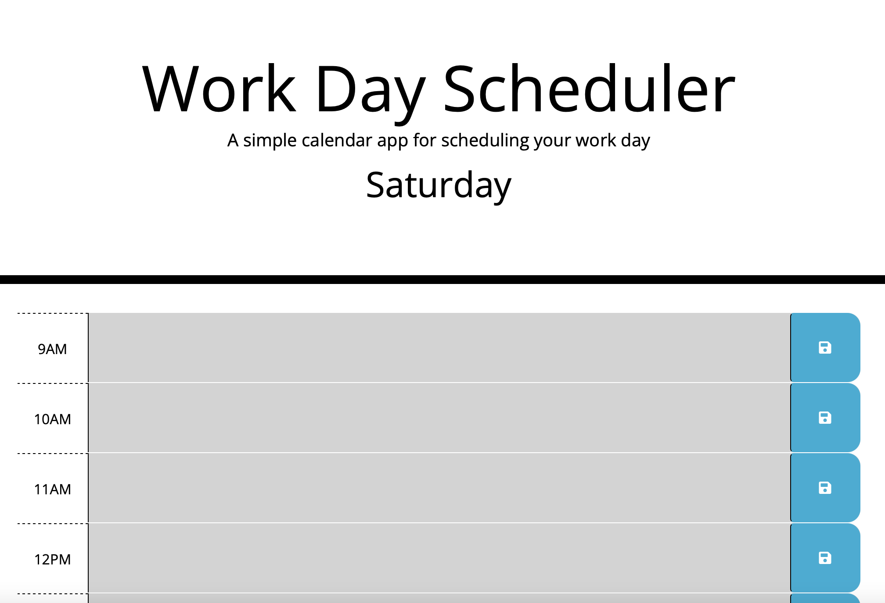

# Third Party API - Workday Scheduler 

This is a project for my Coding Bootcamp course. I was tasked to create a workday scheduler which shows the current day, and imput fields where the user can save events in certain timeslots. 

### User story: 
AS AN employee with a busy schedule
I WANT to add important events to a daily planner
SO THAT I can manage my time effectively

### Acceptance Criteria:
GIVEN I am using a daily planner to create a schedule
WHEN I open the planner
THEN the current day is displayed at the top of the calendar
WHEN I scroll down
THEN I am presented with time blocks for standard business hours
WHEN I view the time blocks for that day
THEN each time block is color-coded to indicate whether it is in the past, present, or future
WHEN I click into a time block
THEN I can enter an event
WHEN I click the save button for that time block
THEN the text for that event is saved in local storage
WHEN I refresh the page
THEN the saved events persist

## Challenges I faced 

- JQuery is still very new to me, I spent a lot of time googling and trying to further my knowledge on this subject.  

## Link to my code on Github
[Link to Github](https://github.com/AlySnyder/workday-scheduler)

## Link to my webpage on Github pages
[Link to Site on Github Pages](https://alysnyder.github.io/workday-scheduler/)

## Image of deployment: 
